# Entity-relationship diagram

Generated by `python -m app.erd` from the SQLAlchemy models (phase 10 §6.2); do not edit by hand.
Entities are named `<schema>__<table>`. A foreign key to another schema is drawn in the referencing schema.

## access

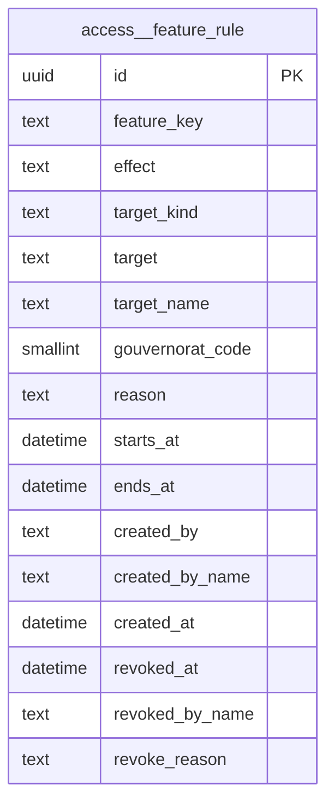
```mermaid
erDiagram
    access__feature_rule {
        uuid id PK
        text feature_key
        text effect
        text target_kind
        text target
        text target_name
        smallint gouvernorat_code
        text reason
        datetime starts_at
        datetime ends_at
        text created_by
        text created_by_name
        datetime created_at
        datetime revoked_at
        text revoked_by_name
        text revoke_reason
    }
```

## ai

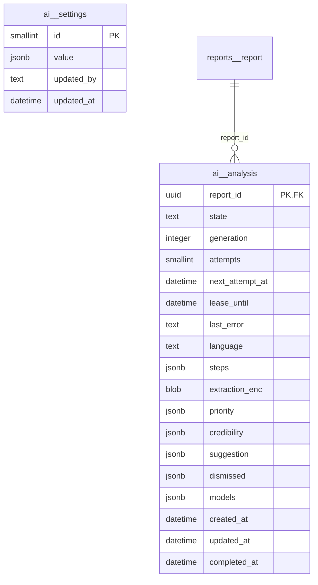
```mermaid
erDiagram
    ai__analysis {
        uuid report_id PK,FK
        text state
        integer generation
        smallint attempts
        datetime next_attempt_at
        datetime lease_until
        text last_error
        text language
        jsonb steps
        blob extraction_enc
        jsonb priority
        jsonb credibility
        jsonb suggestion
        jsonb dismissed
        jsonb models
        datetime created_at
        datetime updated_at
        datetime completed_at
    }
    ai__settings {
        smallint id PK
        jsonb value
        text updated_by
        datetime updated_at
    }
    reports__report ||--o{ ai__analysis : "report_id"
```

## analytics

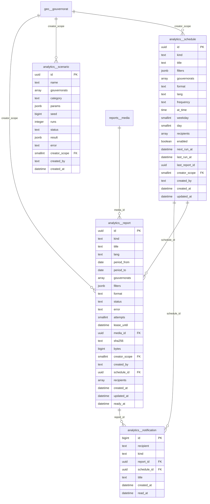
```mermaid
erDiagram
    analytics__notification {
        bigint id PK
        text recipient
        text kind
        uuid report_id FK
        uuid schedule_id FK
        text title
        datetime created_at
        datetime read_at
    }
    analytics__report {
        uuid id PK
        text kind
        text title
        text lang
        date period_from
        date period_to
        array gouvernorats
        jsonb filters
        text format
        text status
        text error
        smallint attempts
        datetime lease_until
        uuid media_id FK
        text sha256
        bigint bytes
        smallint creator_scope FK
        text created_by
        uuid schedule_id FK
        array recipients
        datetime created_at
        datetime updated_at
        datetime ready_at
    }
    analytics__scenario {
        uuid id PK
        text name
        array gouvernorats
        text category
        jsonb params
        bigint seed
        integer runs
        text status
        jsonb result
        text error
        smallint creator_scope FK
        text created_by
        datetime created_at
    }
    analytics__schedule {
        uuid id PK
        text kind
        text title
        jsonb filters
        array gouvernorats
        text format
        text lang
        text frequency
        time at_time
        smallint weekday
        smallint day
        array recipients
        boolean enabled
        datetime next_run_at
        datetime last_run_at
        uuid last_report_id
        smallint creator_scope FK
        text created_by
        datetime created_at
        datetime updated_at
    }
    analytics__report ||--o{ analytics__notification : "report_id"
    analytics__schedule ||--o{ analytics__notification : "schedule_id"
    analytics__schedule ||--o{ analytics__report : "schedule_id"
    geo__gouvernorat ||--o{ analytics__report : "creator_scope"
    geo__gouvernorat ||--o{ analytics__scenario : "creator_scope"
    geo__gouvernorat ||--o{ analytics__schedule : "creator_scope"
    reports__media ||--o{ analytics__report : "media_id"
```

## audit

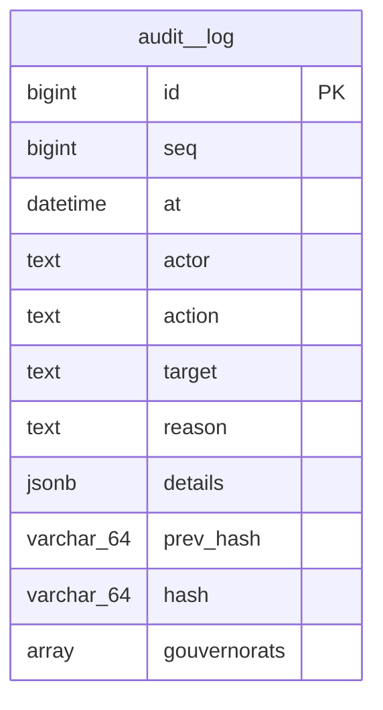
```mermaid
erDiagram
    audit__log {
        bigint id PK
        bigint seq
        datetime at
        text actor
        text action
        text target
        text reason
        jsonb details
        varchar_64 prev_hash
        varchar_64 hash
        array gouvernorats
    }
```

## coastal

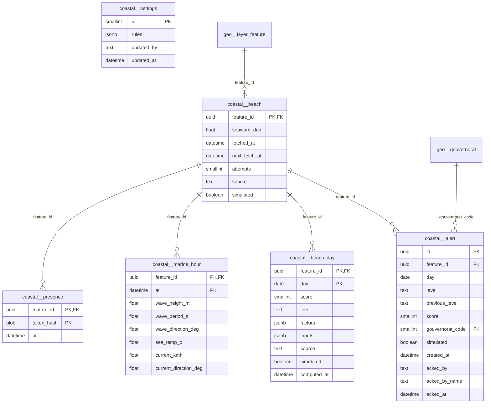
```mermaid
erDiagram
    coastal__alert {
        uuid id PK
        uuid feature_id FK
        date day
        text level
        text previous_level
        smallint score
        smallint gouvernorat_code FK
        boolean simulated
        datetime created_at
        text acked_by
        text acked_by_name
        datetime acked_at
    }
    coastal__beach {
        uuid feature_id PK,FK
        float seaward_deg
        datetime fetched_at
        datetime next_fetch_at
        smallint attempts
        text source
        boolean simulated
    }
    coastal__beach_day {
        uuid feature_id PK,FK
        date day PK
        smallint score
        text level
        jsonb factors
        jsonb inputs
        text source
        boolean simulated
        datetime computed_at
    }
    coastal__marine_hour {
        uuid feature_id PK,FK
        datetime at PK
        float wave_height_m
        float wave_period_s
        float wave_direction_deg
        float sea_temp_c
        float current_kmh
        float current_direction_deg
    }
    coastal__presence {
        uuid feature_id PK,FK
        blob token_hash PK
        datetime at
    }
    coastal__settings {
        smallint id PK
        jsonb rules
        text updated_by
        datetime updated_at
    }
    coastal__beach ||--o{ coastal__alert : "feature_id"
    coastal__beach ||--o{ coastal__beach_day : "feature_id"
    coastal__beach ||--o{ coastal__marine_hour : "feature_id"
    coastal__beach ||--o{ coastal__presence : "feature_id"
    geo__gouvernorat ||--o{ coastal__alert : "gouvernorat_code"
    geo__layer_feature ||--o{ coastal__beach : "feature_id"
```

## contact

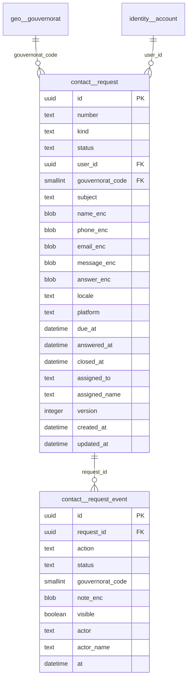
```mermaid
erDiagram
    contact__request {
        uuid id PK
        text number
        text kind
        text status
        uuid user_id FK
        smallint gouvernorat_code FK
        text subject
        blob name_enc
        blob phone_enc
        blob email_enc
        blob message_enc
        blob answer_enc
        text locale
        text platform
        datetime due_at
        datetime answered_at
        datetime closed_at
        text assigned_to
        text assigned_name
        integer version
        datetime created_at
        datetime updated_at
    }
    contact__request_event {
        uuid id PK
        uuid request_id FK
        text action
        text status
        smallint gouvernorat_code
        blob note_enc
        boolean visible
        text actor
        text actor_name
        datetime at
    }
    contact__request ||--o{ contact__request_event : "request_id"
    geo__gouvernorat ||--o{ contact__request : "gouvernorat_code"
    identity__account ||--o{ contact__request : "user_id"
```

## content

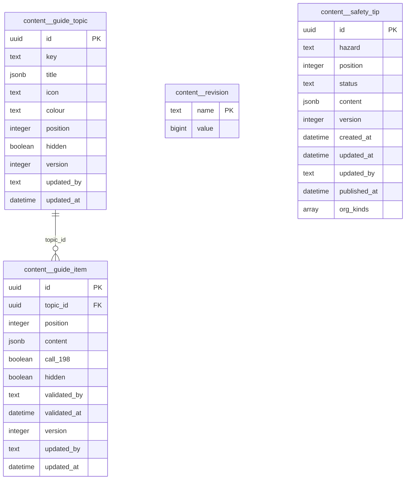
```mermaid
erDiagram
    content__guide_item {
        uuid id PK
        uuid topic_id FK
        integer position
        jsonb content
        boolean call_198
        boolean hidden
        text validated_by
        datetime validated_at
        integer version
        text updated_by
        datetime updated_at
    }
    content__guide_topic {
        uuid id PK
        text key
        jsonb title
        text icon
        text colour
        integer position
        boolean hidden
        integer version
        text updated_by
        datetime updated_at
    }
    content__revision {
        text name PK
        bigint value
    }
    content__safety_tip {
        uuid id PK
        text hazard
        integer position
        text status
        jsonb content
        integer version
        datetime created_at
        datetime updated_at
        text updated_by
        datetime published_at
        array org_kinds
    }
    content__guide_topic ||--o{ content__guide_item : "topic_id"
```

## crisis

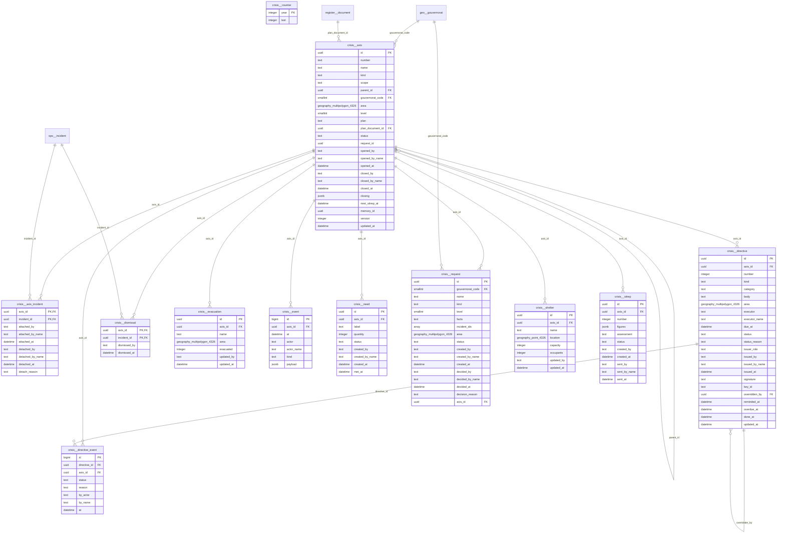
```mermaid
erDiagram
    crisis__axis {
        uuid id PK
        text number
        text name
        text kind
        text scope
        uuid parent_id FK
        smallint gouvernorat_code FK
        geography_multipolygon_4326 area
        smallint level
        text plan
        uuid plan_document_id FK
        text status
        uuid request_id
        text opened_by
        text opened_by_name
        datetime opened_at
        text closed_by
        text closed_by_name
        datetime closed_at
        jsonb closing
        datetime next_sitrep_at
        uuid memory_id
        integer version
        datetime updated_at
    }
    crisis__axis_incident {
        uuid axis_id PK,FK
        uuid incident_id PK,FK
        text attached_by
        text attached_by_name
        datetime attached_at
        text detached_by
        text detached_by_name
        datetime detached_at
        text detach_reason
    }
    crisis__counter {
        integer year PK
        integer last
    }
    crisis__directive {
        uuid id PK
        uuid axis_id FK
        integer number
        text kind
        text category
        text body
        geography_multipolygon_4326 area
        text executor
        text executor_name
        datetime due_at
        text status
        text status_reason
        text issuer_role
        text issued_by
        text issued_by_name
        datetime issued_at
        text signature
        text key_id
        uuid overridden_by FK
        datetime reminded_at
        datetime overdue_at
        datetime done_at
        datetime updated_at
    }
    crisis__directive_event {
        bigint id PK
        uuid directive_id FK
        uuid axis_id FK
        text status
        text reason
        text by_actor
        text by_name
        datetime at
    }
    crisis__dismissal {
        uuid axis_id PK,FK
        uuid incident_id PK,FK
        text dismissed_by
        datetime dismissed_at
    }
    crisis__evacuation {
        uuid id PK
        uuid axis_id FK
        text name
        geography_multipolygon_4326 area
        integer evacuated
        text updated_by
        datetime updated_at
    }
    crisis__event {
        bigint id PK
        uuid axis_id FK
        datetime at
        text actor
        text actor_name
        text kind
        jsonb payload
    }
    crisis__need {
        uuid id PK
        uuid axis_id FK
        text label
        integer quantity
        text status
        text created_by
        text created_by_name
        datetime created_at
        datetime met_at
    }
    crisis__request {
        uuid id PK
        smallint gouvernorat_code FK
        text name
        text kind
        smallint level
        text facts
        array incident_ids
        geography_multipolygon_4326 area
        text status
        text created_by
        text created_by_name
        datetime created_at
        text decided_by
        text decided_by_name
        datetime decided_at
        text decision_reason
        uuid axis_id FK
    }
    crisis__shelter {
        uuid id PK
        uuid axis_id FK
        text name
        geography_point_4326 location
        integer capacity
        integer occupants
        text updated_by
        datetime updated_at
    }
    crisis__sitrep {
        uuid id PK
        uuid axis_id FK
        integer number
        jsonb figures
        text assessment
        text status
        text created_by
        datetime created_at
        text sent_by
        text sent_by_name
        datetime sent_at
    }
    crisis__axis ||--o{ crisis__axis : "parent_id"
    crisis__axis ||--o{ crisis__axis_incident : "axis_id"
    crisis__axis ||--o{ crisis__directive : "axis_id"
    crisis__axis ||--o{ crisis__directive_event : "axis_id"
    crisis__axis ||--o{ crisis__dismissal : "axis_id"
    crisis__axis ||--o{ crisis__evacuation : "axis_id"
    crisis__axis ||--o{ crisis__event : "axis_id"
    crisis__axis ||--o{ crisis__need : "axis_id"
    crisis__axis ||--o{ crisis__request : "axis_id"
    crisis__axis ||--o{ crisis__shelter : "axis_id"
    crisis__axis ||--o{ crisis__sitrep : "axis_id"
    crisis__directive ||--o{ crisis__directive : "overridden_by"
    crisis__directive ||--o{ crisis__directive_event : "directive_id"
    geo__gouvernorat ||--o{ crisis__axis : "gouvernorat_code"
    geo__gouvernorat ||--o{ crisis__request : "gouvernorat_code"
    ops__incident ||--o{ crisis__axis_incident : "incident_id"
    ops__incident ||--o{ crisis__dismissal : "incident_id"
    register__document ||--o{ crisis__axis : "plan_document_id"
```

## decision

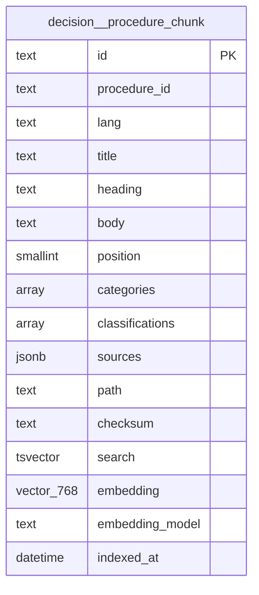
```mermaid
erDiagram
    decision__procedure_chunk {
        text id PK
        text procedure_id
        text lang
        text title
        text heading
        text body
        smallint position
        array categories
        array classifications
        jsonb sources
        text path
        text checksum
        tsvector search
        vector_768 embedding
        text embedding_model
        datetime indexed_at
    }
```

## decision_window

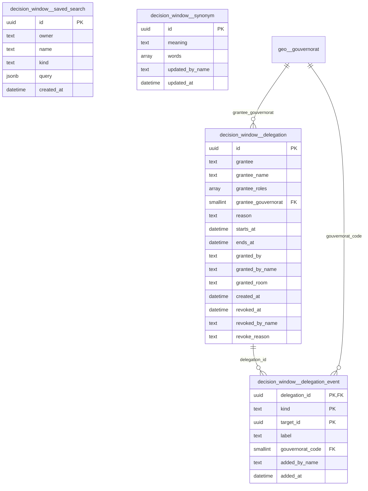
```mermaid
erDiagram
    decision_window__delegation {
        uuid id PK
        text grantee
        text grantee_name
        array grantee_roles
        smallint grantee_gouvernorat FK
        text reason
        datetime starts_at
        datetime ends_at
        text granted_by
        text granted_by_name
        text granted_room
        datetime created_at
        datetime revoked_at
        text revoked_by_name
        text revoke_reason
    }
    decision_window__delegation_event {
        uuid delegation_id PK,FK
        text kind PK
        uuid target_id PK
        text label
        smallint gouvernorat_code FK
        text added_by_name
        datetime added_at
    }
    decision_window__saved_search {
        uuid id PK
        text owner
        text name
        text kind
        jsonb query
        datetime created_at
    }
    decision_window__synonym {
        uuid id PK
        text meaning
        array words
        text updated_by_name
        datetime updated_at
    }
    decision_window__delegation ||--o{ decision_window__delegation_event : "delegation_id"
    geo__gouvernorat ||--o{ decision_window__delegation : "grantee_gouvernorat"
    geo__gouvernorat ||--o{ decision_window__delegation_event : "gouvernorat_code"
```

## drill

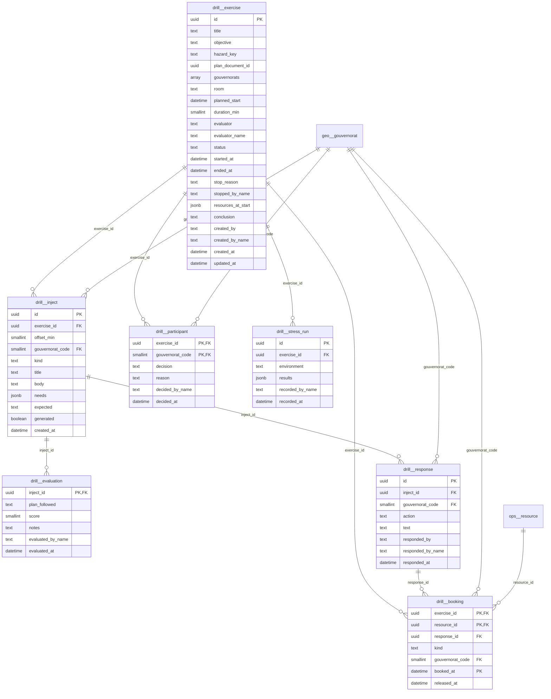
```mermaid
erDiagram
    drill__booking {
        uuid exercise_id PK,FK
        uuid resource_id PK,FK
        uuid response_id FK
        text kind
        smallint gouvernorat_code FK
        datetime booked_at PK
        datetime released_at
    }
    drill__evaluation {
        uuid inject_id PK,FK
        text plan_followed
        smallint score
        text notes
        text evaluated_by_name
        datetime evaluated_at
    }
    drill__exercise {
        uuid id PK
        text title
        text objective
        text hazard_key
        uuid plan_document_id
        array gouvernorats
        text room
        datetime planned_start
        smallint duration_min
        text evaluator
        text evaluator_name
        text status
        datetime started_at
        datetime ended_at
        text stop_reason
        text stopped_by_name
        jsonb resources_at_start
        text conclusion
        text created_by
        text created_by_name
        datetime created_at
        datetime updated_at
    }
    drill__inject {
        uuid id PK
        uuid exercise_id FK
        smallint offset_min
        smallint gouvernorat_code FK
        text kind
        text title
        text body
        jsonb needs
        text expected
        boolean generated
        datetime created_at
    }
    drill__participant {
        uuid exercise_id PK,FK
        smallint gouvernorat_code PK,FK
        text decision
        text reason
        text decided_by_name
        datetime decided_at
    }
    drill__response {
        uuid id PK
        uuid inject_id FK
        smallint gouvernorat_code FK
        text action
        text text
        text responded_by
        text responded_by_name
        datetime responded_at
    }
    drill__stress_run {
        uuid id PK
        uuid exercise_id FK
        text environment
        jsonb results
        text recorded_by_name
        datetime recorded_at
    }
    drill__exercise ||--o{ drill__booking : "exercise_id"
    drill__exercise ||--o{ drill__inject : "exercise_id"
    drill__exercise ||--o{ drill__participant : "exercise_id"
    drill__exercise ||--o{ drill__stress_run : "exercise_id"
    drill__inject ||--o{ drill__evaluation : "inject_id"
    drill__inject ||--o{ drill__response : "inject_id"
    drill__response ||--o{ drill__booking : "response_id"
    geo__gouvernorat ||--o{ drill__booking : "gouvernorat_code"
    geo__gouvernorat ||--o{ drill__inject : "gouvernorat_code"
    geo__gouvernorat ||--o{ drill__participant : "gouvernorat_code"
    geo__gouvernorat ||--o{ drill__response : "gouvernorat_code"
    ops__resource ||--o{ drill__booking : "resource_id"
```

## evidence

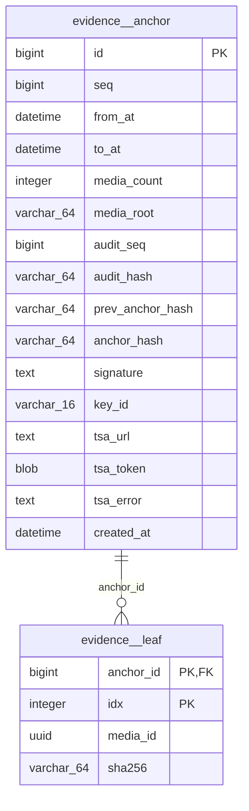
```mermaid
erDiagram
    evidence__anchor {
        bigint id PK
        bigint seq
        datetime from_at
        datetime to_at
        integer media_count
        varchar_64 media_root
        bigint audit_seq
        varchar_64 audit_hash
        varchar_64 prev_anchor_hash
        varchar_64 anchor_hash
        text signature
        varchar_16 key_id
        text tsa_url
        blob tsa_token
        text tsa_error
        datetime created_at
    }
    evidence__leaf {
        bigint anchor_id PK,FK
        integer idx PK
        uuid media_id
        varchar_64 sha256
    }
    evidence__anchor ||--o{ evidence__leaf : "anchor_id"
```

## feedback

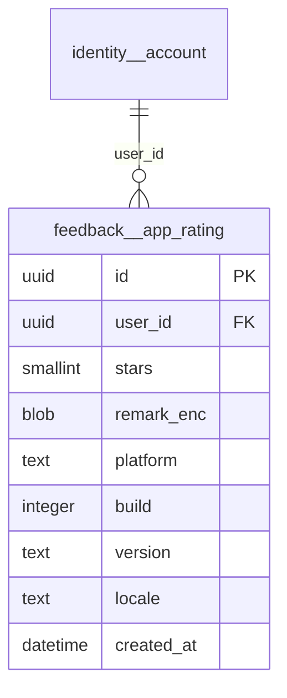
```mermaid
erDiagram
    feedback__app_rating {
        uuid id PK
        uuid user_id FK
        smallint stars
        blob remark_enc
        text platform
        integer build
        text version
        text locale
        datetime created_at
    }
    identity__account ||--o{ feedback__app_rating : "user_id"
```

## forecast

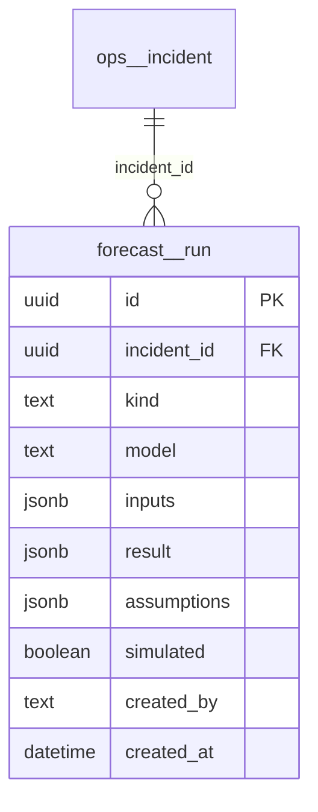
```mermaid
erDiagram
    forecast__run {
        uuid id PK
        uuid incident_id FK
        text kind
        text model
        jsonb inputs
        jsonb result
        jsonb assumptions
        boolean simulated
        text created_by
        datetime created_at
    }
    ops__incident ||--o{ forecast__run : "incident_id"
```

## geo

```mermaid
erDiagram
    geo__basemap {
        text key PK
        text provider
        text url_template
        blob api_key
        text key_header
        text attribution
        smallint max_zoom
        boolean enabled
        boolean last_test_ok
        datetime last_test_at
        text updated_by
        text updated_by_name
        datetime updated_at
    }
    geo__delegation {
        integer id PK
        text code
        smallint gouvernorat_code FK
        text name_ar
        text name_fr
        geometry_multipolygon_4326 boundary
    }
    geo__gouvernorat {
        smallint code PK
        text iso_code
        text name_ar
        text name_fr
        text name_en
        geometry_multipolygon_4326 boundary
    }
    geo__layer {
        uuid id PK
        text key
        jsonb name
        text icon
        text colour
        text audience
        text source
        text licence
        boolean to_verify
        boolean simulated
        array staff_only
        boolean editors_allowed
        boolean enabled
        integer version
        integer data_version
        text created_by
        datetime created_at
        text updated_by
        text updated_by_name
        datetime updated_at
        text status
        array audiences
        array scope
        boolean default_on
        boolean sensitive
        jsonb fields
        jsonb actions
        datetime deleted_at
        text deleted_by
        text delete_reason
        text group_key FK
    }
    geo__layer_feature {
        uuid id PK
        uuid layer_id FK
        text ref
        text name
        text kind
        text phone
        geography_point_4326 location
        smallint gouvernorat_code FK
        integer delegation_id FK
        jsonb props
        boolean hidden
        uuid import_id FK
        integer version
        text updated_by
        datetime updated_at
        geography_geometry_4326 shape
        text name_status
        text suggested_name
        text name_confidence
        text name_source
        text source_url
        date snapshot_at
        boolean possible_duplicate
        datetime deleted_at
        text deleted_by
        text delete_reason
    }
    geo__layer_group {
        text key PK
        jsonb name
        text icon
        text tone
        integer position
        boolean sensitive
        datetime created_at
        datetime updated_at
        text updated_by
    }
    geo__layer_import {
        uuid id PK
        uuid layer_id FK
        text file_name
        text sha256
        text format
        text mode
        text status
        jsonb counts
        jsonb rejected
        jsonb warnings
        jsonb rows
        jsonb undo
        integer base_version
        integer result_version
        text reason
        text created_by
        text created_by_name
        datetime created_at
        datetime applied_at
        datetime undone_at
    }
    geo__layer_revision {
        uuid id PK
        uuid layer_id FK
        integer number
        text action
        jsonb snapshot
        text reason
        text created_by
        text created_by_name
        datetime created_at
    }
    geo__delegation ||--o{ geo__layer_feature : "delegation_id"
    geo__gouvernorat ||--o{ geo__delegation : "gouvernorat_code"
    geo__gouvernorat ||--o{ geo__layer_feature : "gouvernorat_code"
    geo__layer ||--o{ geo__layer_feature : "layer_id"
    geo__layer ||--o{ geo__layer_import : "layer_id"
    geo__layer ||--o{ geo__layer_revision : "layer_id"
    geo__layer_group ||--o{ geo__layer : "group_key"
    geo__layer_import ||--o{ geo__layer_feature : "import_id"
```

## identity

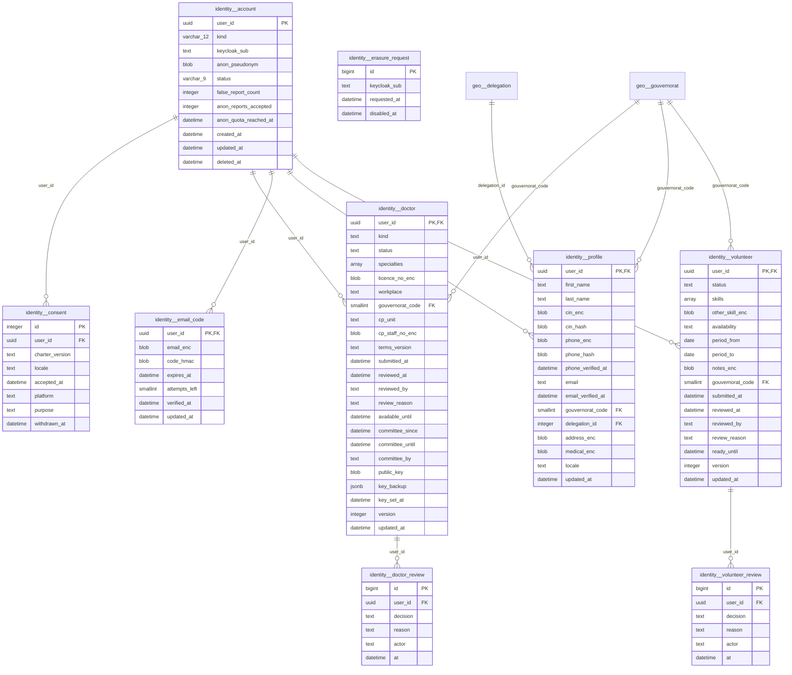
```mermaid
erDiagram
    identity__account {
        uuid user_id PK
        varchar_12 kind
        text keycloak_sub
        blob anon_pseudonym
        varchar_9 status
        integer false_report_count
        integer anon_reports_accepted
        datetime anon_quota_reached_at
        datetime created_at
        datetime updated_at
        datetime deleted_at
    }
    identity__consent {
        integer id PK
        uuid user_id FK
        text charter_version
        text locale
        datetime accepted_at
        text platform
        text purpose
        datetime withdrawn_at
    }
    identity__doctor {
        uuid user_id PK,FK
        text kind
        text status
        array specialties
        blob licence_no_enc
        text workplace
        smallint gouvernorat_code FK
        text cp_unit
        blob cp_staff_no_enc
        text terms_version
        datetime submitted_at
        datetime reviewed_at
        text reviewed_by
        text review_reason
        datetime available_until
        datetime committee_since
        datetime committee_until
        text committee_by
        blob public_key
        jsonb key_backup
        datetime key_set_at
        integer version
        datetime updated_at
    }
    identity__doctor_review {
        bigint id PK
        uuid user_id FK
        text decision
        text reason
        text actor
        datetime at
    }
    identity__email_code {
        uuid user_id PK,FK
        blob email_enc
        blob code_hmac
        datetime expires_at
        smallint attempts_left
        datetime verified_at
        datetime updated_at
    }
    identity__erasure_request {
        bigint id PK
        text keycloak_sub
        datetime requested_at
        datetime disabled_at
    }
    identity__profile {
        uuid user_id PK,FK
        text first_name
        text last_name
        blob cin_enc
        blob cin_hash
        blob phone_enc
        blob phone_hash
        datetime phone_verified_at
        text email
        datetime email_verified_at
        smallint gouvernorat_code FK
        integer delegation_id FK
        blob address_enc
        blob medical_enc
        text locale
        datetime updated_at
    }
    identity__volunteer {
        uuid user_id PK,FK
        text status
        array skills
        blob other_skill_enc
        text availability
        date period_from
        date period_to
        blob notes_enc
        smallint gouvernorat_code FK
        datetime submitted_at
        datetime reviewed_at
        text reviewed_by
        text review_reason
        datetime ready_until
        integer version
        datetime updated_at
    }
    identity__volunteer_review {
        bigint id PK
        uuid user_id FK
        text decision
        text reason
        text actor
        datetime at
    }
    geo__delegation ||--o{ identity__profile : "delegation_id"
    geo__gouvernorat ||--o{ identity__doctor : "gouvernorat_code"
    geo__gouvernorat ||--o{ identity__profile : "gouvernorat_code"
    geo__gouvernorat ||--o{ identity__volunteer : "gouvernorat_code"
    identity__account ||--o{ identity__consent : "user_id"
    identity__account ||--o{ identity__doctor : "user_id"
    identity__account ||--o{ identity__email_code : "user_id"
    identity__account ||--o{ identity__profile : "user_id"
    identity__account ||--o{ identity__volunteer : "user_id"
    identity__doctor ||--o{ identity__doctor_review : "user_id"
    identity__volunteer ||--o{ identity__volunteer_review : "user_id"
```

## inv

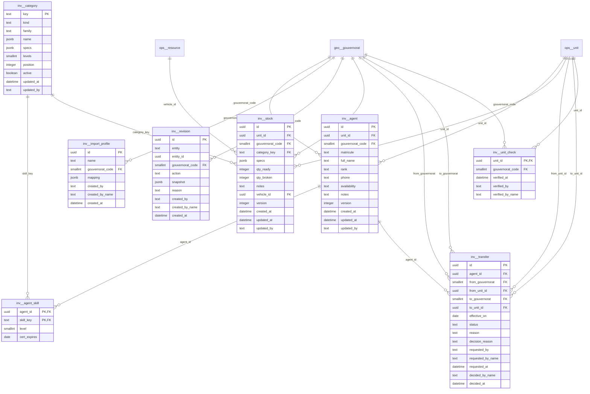
```mermaid
erDiagram
    inv__agent {
        uuid id PK
        uuid unit_id FK
        smallint gouvernorat_code FK
        text matricule
        text full_name
        text rank
        text phone
        text availability
        text notes
        integer version
        datetime created_at
        datetime updated_at
        text updated_by
    }
    inv__agent_skill {
        uuid agent_id PK,FK
        text skill_key PK,FK
        smallint level
        date cert_expires
    }
    inv__category {
        text key PK
        text kind
        text family
        jsonb name
        jsonb specs
        smallint levels
        integer position
        boolean active
        datetime updated_at
        text updated_by
    }
    inv__import_profile {
        uuid id PK
        text name
        smallint gouvernorat_code FK
        jsonb mapping
        text created_by
        text created_by_name
        datetime created_at
    }
    inv__revision {
        uuid id PK
        text entity
        uuid entity_id
        smallint gouvernorat_code FK
        text action
        jsonb snapshot
        text reason
        text created_by
        text created_by_name
        datetime created_at
    }
    inv__stock {
        uuid id PK
        uuid unit_id FK
        smallint gouvernorat_code FK
        text category_key FK
        jsonb specs
        integer qty_ready
        integer qty_broken
        text notes
        uuid vehicle_id FK
        integer version
        datetime created_at
        datetime updated_at
        text updated_by
    }
    inv__transfer {
        uuid id PK
        uuid agent_id FK
        smallint from_gouvernorat FK
        uuid from_unit_id FK
        smallint to_gouvernorat FK
        uuid to_unit_id FK
        date effective_on
        text status
        text reason
        text decision_reason
        text requested_by
        text requested_by_name
        datetime requested_at
        text decided_by_name
        datetime decided_at
    }
    inv__unit_check {
        uuid unit_id PK,FK
        smallint gouvernorat_code FK
        datetime verified_at
        text verified_by
        text verified_by_name
    }
    geo__gouvernorat ||--o{ inv__agent : "gouvernorat_code"
    geo__gouvernorat ||--o{ inv__import_profile : "gouvernorat_code"
    geo__gouvernorat ||--o{ inv__revision : "gouvernorat_code"
    geo__gouvernorat ||--o{ inv__stock : "gouvernorat_code"
    geo__gouvernorat ||--o{ inv__transfer : "from_gouvernorat"
    geo__gouvernorat ||--o{ inv__transfer : "to_gouvernorat"
    geo__gouvernorat ||--o{ inv__unit_check : "gouvernorat_code"
    inv__agent ||--o{ inv__agent_skill : "agent_id"
    inv__agent ||--o{ inv__transfer : "agent_id"
    inv__category ||--o{ inv__agent_skill : "skill_key"
    inv__category ||--o{ inv__stock : "category_key"
    ops__resource ||--o{ inv__stock : "vehicle_id"
    ops__unit ||--o{ inv__agent : "unit_id"
    ops__unit ||--o{ inv__stock : "unit_id"
    ops__unit ||--o{ inv__transfer : "from_unit_id"
    ops__unit ||--o{ inv__transfer : "to_unit_id"
    ops__unit ||--o{ inv__unit_check : "unit_id"
```

## knowledge

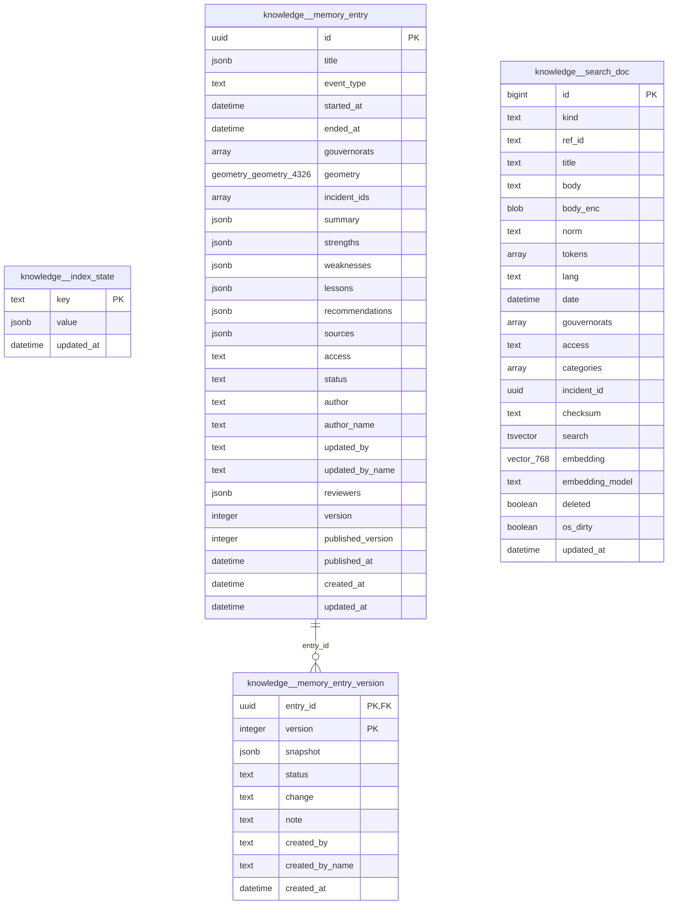
```mermaid
erDiagram
    knowledge__index_state {
        text key PK
        jsonb value
        datetime updated_at
    }
    knowledge__memory_entry {
        uuid id PK
        jsonb title
        text event_type
        datetime started_at
        datetime ended_at
        array gouvernorats
        geometry_geometry_4326 geometry
        array incident_ids
        jsonb summary
        jsonb strengths
        jsonb weaknesses
        jsonb lessons
        jsonb recommendations
        jsonb sources
        text access
        text status
        text author
        text author_name
        text updated_by
        text updated_by_name
        jsonb reviewers
        integer version
        integer published_version
        datetime published_at
        datetime created_at
        datetime updated_at
    }
    knowledge__memory_entry_version {
        uuid entry_id PK,FK
        integer version PK
        jsonb snapshot
        text status
        text change
        text note
        text created_by
        text created_by_name
        datetime created_at
    }
    knowledge__search_doc {
        bigint id PK
        text kind
        text ref_id
        text title
        text body
        blob body_enc
        text norm
        array tokens
        text lang
        datetime date
        array gouvernorats
        text access
        array categories
        uuid incident_id
        text checksum
        tsvector search
        vector_768 embedding
        text embedding_model
        boolean deleted
        boolean os_dirty
        datetime updated_at
    }
    knowledge__memory_entry ||--o{ knowledge__memory_entry_version : "entry_id"
```

## medical

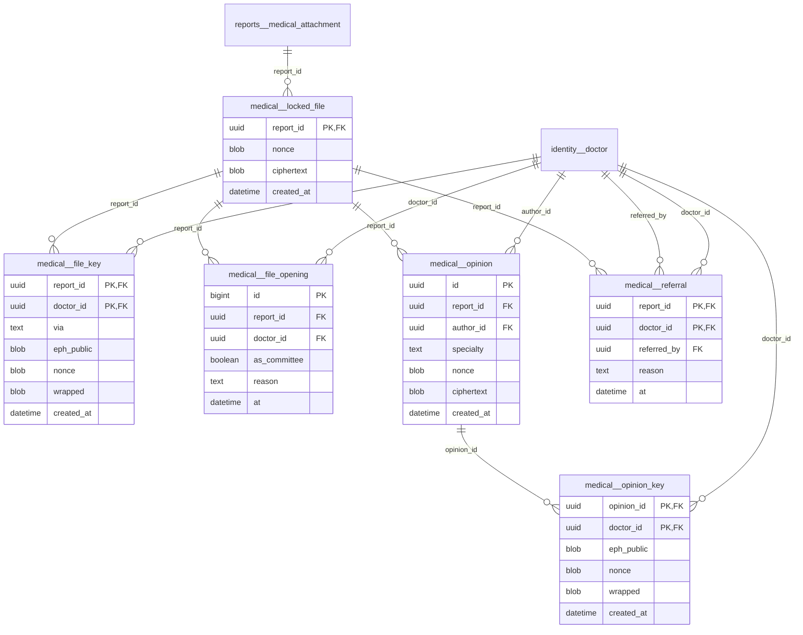
```mermaid
erDiagram
    medical__file_key {
        uuid report_id PK,FK
        uuid doctor_id PK,FK
        text via
        blob eph_public
        blob nonce
        blob wrapped
        datetime created_at
    }
    medical__file_opening {
        bigint id PK
        uuid report_id FK
        uuid doctor_id FK
        boolean as_committee
        text reason
        datetime at
    }
    medical__locked_file {
        uuid report_id PK,FK
        blob nonce
        blob ciphertext
        datetime created_at
    }
    medical__opinion {
        uuid id PK
        uuid report_id FK
        uuid author_id FK
        text specialty
        blob nonce
        blob ciphertext
        datetime created_at
    }
    medical__opinion_key {
        uuid opinion_id PK,FK
        uuid doctor_id PK,FK
        blob eph_public
        blob nonce
        blob wrapped
        datetime created_at
    }
    medical__referral {
        uuid report_id PK,FK
        uuid doctor_id PK,FK
        uuid referred_by FK
        text reason
        datetime at
    }
    identity__doctor ||--o{ medical__file_key : "doctor_id"
    identity__doctor ||--o{ medical__file_opening : "doctor_id"
    identity__doctor ||--o{ medical__opinion : "author_id"
    identity__doctor ||--o{ medical__opinion_key : "doctor_id"
    identity__doctor ||--o{ medical__referral : "doctor_id"
    identity__doctor ||--o{ medical__referral : "referred_by"
    medical__locked_file ||--o{ medical__file_key : "report_id"
    medical__locked_file ||--o{ medical__file_opening : "report_id"
    medical__locked_file ||--o{ medical__opinion : "report_id"
    medical__locked_file ||--o{ medical__referral : "report_id"
    medical__opinion ||--o{ medical__opinion_key : "opinion_id"
    reports__medical_attachment ||--o{ medical__locked_file : "report_id"
```

## notify

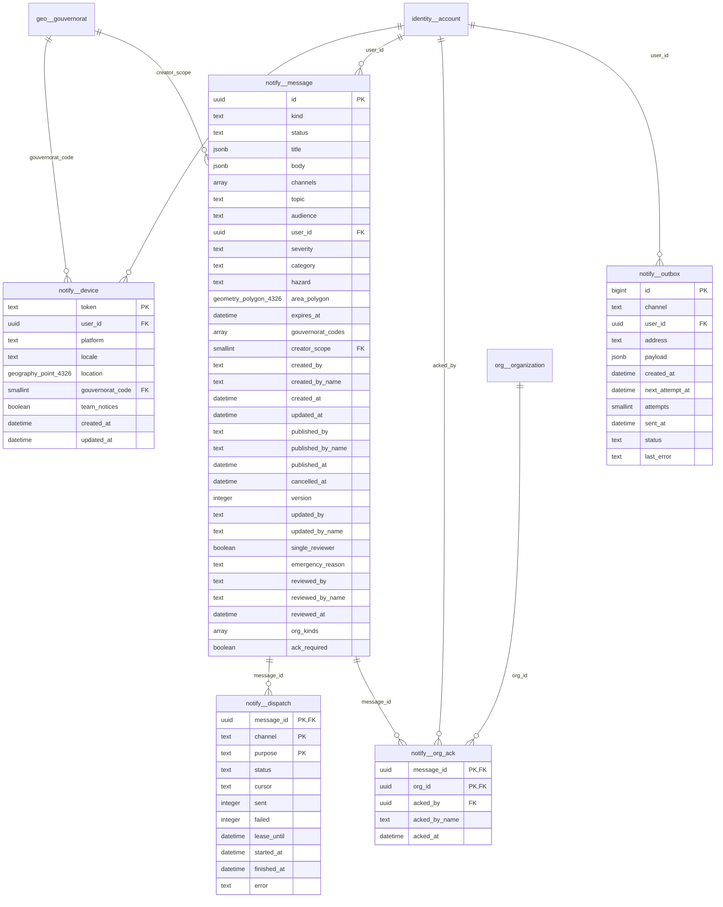
```mermaid
erDiagram
    notify__device {
        text token PK
        uuid user_id FK
        text platform
        text locale
        geography_point_4326 location
        smallint gouvernorat_code FK
        boolean team_notices
        datetime created_at
        datetime updated_at
    }
    notify__dispatch {
        uuid message_id PK,FK
        text channel PK
        text purpose PK
        text status
        text cursor
        integer sent
        integer failed
        datetime lease_until
        datetime started_at
        datetime finished_at
        text error
    }
    notify__message {
        uuid id PK
        text kind
        text status
        jsonb title
        jsonb body
        array channels
        text topic
        text audience
        uuid user_id FK
        text severity
        text category
        text hazard
        geometry_polygon_4326 area_polygon
        datetime expires_at
        array gouvernorat_codes
        smallint creator_scope FK
        text created_by
        text created_by_name
        datetime created_at
        datetime updated_at
        text published_by
        text published_by_name
        datetime published_at
        datetime cancelled_at
        integer version
        text updated_by
        text updated_by_name
        boolean single_reviewer
        text emergency_reason
        text reviewed_by
        text reviewed_by_name
        datetime reviewed_at
        array org_kinds
        boolean ack_required
    }
    notify__org_ack {
        uuid message_id PK,FK
        uuid org_id PK,FK
        uuid acked_by FK
        text acked_by_name
        datetime acked_at
    }
    notify__outbox {
        bigint id PK
        text channel
        uuid user_id FK
        text address
        jsonb payload
        datetime created_at
        datetime next_attempt_at
        smallint attempts
        datetime sent_at
        text status
        text last_error
    }
    geo__gouvernorat ||--o{ notify__device : "gouvernorat_code"
    geo__gouvernorat ||--o{ notify__message : "creator_scope"
    identity__account ||--o{ notify__device : "user_id"
    identity__account ||--o{ notify__message : "user_id"
    identity__account ||--o{ notify__org_ack : "acked_by"
    identity__account ||--o{ notify__outbox : "user_id"
    notify__message ||--o{ notify__dispatch : "message_id"
    notify__message ||--o{ notify__org_ack : "message_id"
    org__organization ||--o{ notify__org_ack : "org_id"
```

## ops

```mermaid
erDiagram
    ops__assignment {
        uuid id PK
        uuid incident_id FK
        text kind
        uuid resource_id FK
        uuid volunteer_id FK
        uuid callout_id FK
        uuid request_id FK
        text order
        text status
        text created_by
        datetime created_at
        datetime en_route_at
        datetime on_scene_at
        datetime released_at
        datetime cancelled_at
        uuid shift_id FK
        datetime acknowledged_at
        text contact_phone
    }
    ops__callout {
        uuid id PK
        uuid incident_id FK
        text skill
        smallint requested
        smallint radius_km
        text message
        text status
        text created_by
        datetime created_at
        datetime closed_at
    }
    ops__callout_target {
        uuid callout_id PK,FK
        uuid volunteer_id PK,FK
        integer distance_m
        text status
        smallint eta_minutes
        datetime sent_at
        datetime responded_at
        datetime arrived_at
        uuid assignment_id FK
    }
    ops__casualty_count {
        uuid incident_id PK,FK
        integer injured_light
        integer injured_serious
        integer deceased
        integer rescued
        integer trapped
        text updated_by
        datetime updated_at
    }
    ops__casualty_transport {
        uuid id PK
        uuid incident_id FK
        uuid assignment_id FK
        text triage
        text age_band
        text sex
        text hospital
        uuid hospital_ref FK
        text created_by
        text created_by_name
        datetime device_at
        datetime created_at
    }
    ops__crew_alert {
        uuid id PK
        uuid incident_id FK
        uuid assignment_id FK
        text kind
        array items
        text created_by
        text created_by_name
        datetime device_at
        datetime created_at
        text seen_by
        text seen_by_name
        datetime seen_at
        text via
    }
    ops__crew_event {
        uuid client_id PK
        uuid assignment_id FK
        uuid shift_id FK
        text kind
        jsonb payload
        text subject
        datetime device_at
        datetime received_at
        text via
    }
    ops__crew_position {
        bigint id PK
        uuid assignment_id FK
        uuid incident_id FK
        uuid resource_id FK
        datetime at
        geography_point_4326 location
        float accuracy_m
        datetime created_at
    }
    ops__directive {
        uuid id PK
        text title
        text body
        text urgency
        text from_level
        array gouvernorat_codes
        smallint issuer_scope FK
        text issued_by
        text issued_by_name
        datetime issued_at
    }
    ops__directive_ack {
        uuid directive_id PK,FK
        smallint gouvernorat_code PK,FK
        text acked_by
        text acked_by_name
        datetime acked_at
        text note
    }
    ops__field_attachment {
        uuid id PK
        uuid incident_id FK
        uuid assignment_id FK
        text kind
        text body
        text object_key
        text content_type
        text sha256
        integer bytes
        float duration_s
        text created_by
        text created_by_name
        datetime device_at
        datetime created_at
    }
    ops__field_report {
        uuid id PK
        uuid incident_id FK
        uuid assignment_id FK
        text kind
        text category
        text classification
        smallint severity
        boolean backup_needed
        text backup_note
        array backup_kinds
        boolean crew_danger
        uuid template_id FK
        integer template_version
        jsonb answers
        text note
        text author
        text author_name
        datetime device_at
        datetime created_at
    }
    ops__incident {
        uuid id PK
        text category
        smallint severity
        geography_point_4326 centroid
        geography_polygon_4326 area
        smallint gouvernorat_code FK
        integer delegation_id FK
        varchar_8 op_level
        text status
        datetime opened_at
        datetime closed_at
        uuid merged_into FK
        datetime updated_at
        text title
        text classification
        jsonb evaluation
        text lead_set_by
        datetime lead_set_at
        text command_level
        text command_level_reason
        boolean command_level_manual
    }
    ops__incident_gouvernorat {
        uuid incident_id PK,FK
        smallint gouvernorat_code PK,FK
        text role
        datetime added_at
        text added_by
        text reason
    }
    ops__level_state {
        smallint gouvernorat_code PK,FK
        varchar_8 level
        datetime since
        text reason
        text set_by
        text set_by_name
    }
    ops__report_template {
        uuid id PK
        text category
        text classification
        integer version
        text status
        jsonb fields
        boolean simulated
        text created_by
        text created_by_name
        datetime created_at
        datetime updated_at
        text approved_by
        text approved_by_name
        datetime approved_at
        datetime retired_at
    }
    ops__resource {
        uuid id PK
        uuid unit_id FK
        text kind
        text label
        text status
        text notes
        geography_point_4326 location
        datetime location_at
        text category_key FK
        jsonb specs
        text code
        smallint year
        text out_reason
        text updated_by
        integer version
        datetime created_at
        datetime updated_at
    }
    ops__resource_request {
        uuid id PK
        uuid incident_id FK
        text from_room
        smallint to_gouvernorat_code FK
        uuid resource_id FK
        text resource_kind
        smallint quantity
        text reason
        text status
        text requested_by
        text requested_by_name
        datetime requested_at
        text decided_by
        text decided_by_name
        datetime decided_at
        text decision_note
    }
    ops__shift {
        uuid id PK
        text subject
        text leader_name
        uuid device_id FK
        uuid resource_id FK
        smallint gouvernorat_code FK
        smallint crew_size
        text crew_names
        datetime started_at
        datetime ended_at
    }
    ops__staff_device {
        uuid id PK
        text subject
        text holder_name
        smallint gouvernorat_code FK
        text label
        text platform
        integer app_build
        text push_token
        blob sms_key_enc
        datetime created_at
        datetime last_seen_at
        datetime revoked_at
        text revoked_by
    }
    ops__timeline_event {
        integer id PK
        uuid incident_id FK
        datetime at
        text actor
        text kind
        jsonb payload
    }
    ops__unit {
        uuid id PK
        text name_ar
        text name_fr
        text kind
        smallint gouvernorat_code FK
        geography_point_4326 location
        text phone
        integer version
        datetime created_at
        datetime updated_at
    }
    geo__delegation ||--o{ ops__incident : "delegation_id"
    geo__gouvernorat ||--o{ ops__directive : "issuer_scope"
    geo__gouvernorat ||--o{ ops__directive_ack : "gouvernorat_code"
    geo__gouvernorat ||--o{ ops__incident : "gouvernorat_code"
    geo__gouvernorat ||--o{ ops__incident_gouvernorat : "gouvernorat_code"
    geo__gouvernorat ||--o{ ops__level_state : "gouvernorat_code"
    geo__gouvernorat ||--o{ ops__resource_request : "to_gouvernorat_code"
    geo__gouvernorat ||--o{ ops__shift : "gouvernorat_code"
    geo__gouvernorat ||--o{ ops__staff_device : "gouvernorat_code"
    geo__gouvernorat ||--o{ ops__unit : "gouvernorat_code"
    geo__layer_feature ||--o{ ops__casualty_transport : "hospital_ref"
    identity__volunteer ||--o{ ops__assignment : "volunteer_id"
    identity__volunteer ||--o{ ops__callout_target : "volunteer_id"
    inv__category ||--o{ ops__resource : "category_key"
    ops__assignment ||--o{ ops__callout_target : "assignment_id"
    ops__assignment ||--o{ ops__casualty_transport : "assignment_id"
    ops__assignment ||--o{ ops__crew_alert : "assignment_id"
    ops__assignment ||--o{ ops__crew_event : "assignment_id"
    ops__assignment ||--o{ ops__crew_position : "assignment_id"
    ops__assignment ||--o{ ops__field_attachment : "assignment_id"
    ops__assignment ||--o{ ops__field_report : "assignment_id"
    ops__callout ||--o{ ops__assignment : "callout_id"
    ops__callout ||--o{ ops__callout_target : "callout_id"
    ops__directive ||--o{ ops__directive_ack : "directive_id"
    ops__incident ||--o{ ops__assignment : "incident_id"
    ops__incident ||--o{ ops__callout : "incident_id"
    ops__incident ||--o{ ops__casualty_count : "incident_id"
    ops__incident ||--o{ ops__casualty_transport : "incident_id"
    ops__incident ||--o{ ops__crew_alert : "incident_id"
    ops__incident ||--o{ ops__crew_position : "incident_id"
    ops__incident ||--o{ ops__field_attachment : "incident_id"
    ops__incident ||--o{ ops__field_report : "incident_id"
    ops__incident ||--o{ ops__incident : "merged_into"
    ops__incident ||--o{ ops__incident_gouvernorat : "incident_id"
    ops__incident ||--o{ ops__resource_request : "incident_id"
    ops__incident ||--o{ ops__timeline_event : "incident_id"
    ops__report_template ||--o{ ops__field_report : "template_id"
    ops__resource ||--o{ ops__assignment : "resource_id"
    ops__resource ||--o{ ops__crew_position : "resource_id"
    ops__resource ||--o{ ops__resource_request : "resource_id"
    ops__resource ||--o{ ops__shift : "resource_id"
    ops__resource_request ||--o{ ops__assignment : "request_id"
    ops__shift ||--o{ ops__assignment : "shift_id"
    ops__shift ||--o{ ops__crew_event : "shift_id"
    ops__staff_device ||--o{ ops__shift : "device_id"
    ops__unit ||--o{ ops__resource : "unit_id"
```

## org

```mermaid
erDiagram
    org__activity {
        uuid id PK
        uuid org_id FK
        text kind
        text title
        date starts_on
        date ends_on
        integer participants
        text notes
        uuid created_by FK
        text created_by_name
        datetime created_at
    }
    org__certificate {
        uuid id PK
        uuid org_id FK
        text code
        text status
        jsonb snapshot
        text fingerprint
        blob signature
        text pdf_object_key
        text pdf_sha256
        uuid created_by FK
        datetime created_at
        uuid submitted_by FK
        datetime submitted_at
        text reviewed_by
        datetime reviewed_at
        text review_reason
        date valid_until
        uuid superseded_by FK
        text key_id
        datetime revoked_at
        text revoked_by
        text revoke_reason
        date reminded_90_on
        date reminded_30_on
        text kind
        uuid visit_id FK
    }
    org__certificate_stamp {
        uuid id PK
        uuid certificate_id FK
        text place
        integer gouvernorat_code
        date stamped_on
        text note
        text stamped_by
        text stamped_by_name
        datetime recorded_at
        jsonb changes
        text photo_object_key
        text photo_sha256
        text photo_content_type
    }
    org__digest {
        uuid org_id PK,FK
        text fingerprint
        datetime sent_at
    }
    org__document {
        uuid id PK
        uuid org_id FK
        text kind
        text title
        datetime created_at
        datetime updated_at
    }
    org__document_version {
        uuid id PK
        uuid document_id FK
        integer version
        text upload_id
        text object_key
        text filename
        text content_type
        bigint bytes
        text sha256
        text note
        text status
        uuid uploaded_by FK
        text uploaded_by_name
        datetime created_at
        datetime stored_at
    }
    org__equipment {
        uuid id PK
        uuid org_id FK
        text kind
        integer count
        text location
        date last_maintenance_on
        smallint maintenance_interval_months
        datetime created_at
        datetime updated_at
    }
    org__hazmat {
        uuid id PK
        uuid org_id FK
        text name
        text un_number
        text hazard_class
        numeric_14__3 quantity
        text unit
        text storage_location
        uuid sds_document_id FK
        datetime created_at
        datetime updated_at
    }
    org__invitation {
        uuid id PK
        uuid org_id FK
        text email
        text role
        blob token_hash
        datetime expires_at
        uuid created_by FK
        datetime created_at
        uuid accepted_by FK
        datetime accepted_at
        datetime revoked_at
    }
    org__maintenance {
        uuid id PK
        uuid org_id FK
        uuid equipment_id FK
        date done_on
        text note
        uuid document_id FK
        uuid recorded_by FK
        text recorded_by_name
        datetime recorded_at
    }
    org__map_feature {
        uuid id PK
        uuid org_id FK
        text kind
        text label
        geography_point_4326 location
        datetime created_at
    }
    org__member {
        uuid org_id PK,FK
        uuid user_id PK,FK
        text role
        text display_name
        text email
        datetime joined_at
    }
    org__organization {
        uuid id PK
        text status
        integer version
        text name
        text kind
        text identifier_type
        text identifier
        text activity_sector
        text activity_type
        integer capacity
        smallint floors
        float height_m
        boolean receives_public
        text address
        geography_point_4326 location
        smallint gouvernorat_code FK
        integer delegation_id FK
        jsonb manager
        text contact_email
        text contact_phone
        jsonb kind_fields
        boolean kind_review
        text review_reason
        text reviewed_by
        datetime reviewed_at
        uuid created_by FK
        datetime created_at
        datetime updated_at
    }
    org__prevention_photo {
        uuid id PK
        uuid visit_id FK
        uuid org_id FK
        text item_key
        text object_key
        text sha256
        integer bytes
        text content_type
        uuid client_id
        text created_by
        text created_by_name
        datetime device_at
        datetime created_at
    }
    org__prevention_reservation {
        uuid id PK
        uuid visit_id FK
        uuid org_id FK
        text item_key
        text text
        date due_on
        text response_note
        text responded_by_name
        datetime responded_at
        text lifted_by
        text lifted_by_name
        text lift_note
        datetime lifted_at
        datetime created_at
    }
    org__prevention_visit {
        uuid id PK
        uuid org_id FK
        text origin
        text status
        text request_note
        uuid requested_by FK
        text requested_by_name
        datetime requested_at
        date scheduled_on
        text inspector_name
        text scheduled_by
        datetime scheduled_at
        date inspected_on
        text attendees
        text inspected_by
        text inspected_by_name
        jsonb declared
        jsonb comparison
        text decision
        text decision_reason
        text decided_by
        text decided_by_name
        datetime decided_at
        text report_object_key
        text report_sha256
        text cancel_reason
        text cancelled_by
        datetime cancelled_at
        text inspector_subject
        uuid inspection_client_id
        datetime inspected_device_at
        text inspector_signature_key
        text representative_name
        text representative_role
        text representative_signature_key
        datetime created_at
    }
    org__team_member {
        uuid id PK
        uuid org_id FK
        text full_name
        text team_role
        text position
        text phone
        text email
        date last_training_on
        smallint training_valid_months
        datetime created_at
        datetime updated_at
    }
    geo__delegation ||--o{ org__organization : "delegation_id"
    geo__gouvernorat ||--o{ org__organization : "gouvernorat_code"
    identity__account ||--o{ org__activity : "created_by"
    identity__account ||--o{ org__certificate : "created_by"
    identity__account ||--o{ org__certificate : "submitted_by"
    identity__account ||--o{ org__document_version : "uploaded_by"
    identity__account ||--o{ org__invitation : "accepted_by"
    identity__account ||--o{ org__invitation : "created_by"
    identity__account ||--o{ org__maintenance : "recorded_by"
    identity__account ||--o{ org__member : "user_id"
    identity__account ||--o{ org__organization : "created_by"
    identity__account ||--o{ org__prevention_visit : "requested_by"
    org__certificate ||--o{ org__certificate : "superseded_by"
    org__certificate ||--o{ org__certificate_stamp : "certificate_id"
    org__document ||--o{ org__document_version : "document_id"
    org__document ||--o{ org__hazmat : "sds_document_id"
    org__document ||--o{ org__maintenance : "document_id"
    org__equipment ||--o{ org__maintenance : "equipment_id"
    org__organization ||--o{ org__activity : "org_id"
    org__organization ||--o{ org__certificate : "org_id"
    org__organization ||--o{ org__digest : "org_id"
    org__organization ||--o{ org__document : "org_id"
    org__organization ||--o{ org__equipment : "org_id"
    org__organization ||--o{ org__hazmat : "org_id"
    org__organization ||--o{ org__invitation : "org_id"
    org__organization ||--o{ org__maintenance : "org_id"
    org__organization ||--o{ org__map_feature : "org_id"
    org__organization ||--o{ org__member : "org_id"
    org__organization ||--o{ org__prevention_photo : "org_id"
    org__organization ||--o{ org__prevention_reservation : "org_id"
    org__organization ||--o{ org__prevention_visit : "org_id"
    org__organization ||--o{ org__team_member : "org_id"
    org__prevention_visit ||--o{ org__certificate : "visit_id"
    org__prevention_visit ||--o{ org__prevention_photo : "visit_id"
    org__prevention_visit ||--o{ org__prevention_reservation : "visit_id"
```

## programme

```mermaid
erDiagram
    programme__point {
        uuid id PK
        uuid programme_id FK
        text ref
        smallint gouvernorat_code FK
        text place_name
        text sub_points
        geography_point_4326 location
        text geo_confidence
        text geo_note
        integer staff_count
        text staff_composition
        integer supervisors
        integer lifeguards_planned
        integer lifeguards_deployed
        text equipment
        text hours
        date opening_date
        date closing_date
        text status
        text supervisor_name
        text supervisor_phone
        text notes
        text updated_by
        datetime updated_at
    }
    programme__programme {
        uuid id PK
        text code
        text kind
        text title
        text season
        date valid_from
        date valid_to
        text status
        integer version
        text source_document
        jsonb declared
        text approved_by
        text approved_by_name
        datetime approved_at
        text cancel_reason
        uuid layer_id FK
        text created_by
        datetime created_at
        text updated_by
        text updated_by_name
        datetime updated_at
    }
    programme__revision {
        uuid id PK
        uuid programme_id FK
        integer number
        text action
        text reason
        jsonb snapshot
        text created_by
        text created_by_name
        datetime created_at
    }
    geo__gouvernorat ||--o{ programme__point : "gouvernorat_code"
    geo__layer ||--o{ programme__programme : "layer_id"
    programme__programme ||--o{ programme__point : "programme_id"
    programme__programme ||--o{ programme__revision : "programme_id"
```

## register

```mermaid
erDiagram
    register__attachment {
        uuid id PK
        uuid dispatch_id FK
        uuid reply_id FK
        smallint gouvernorat_code FK
        text file_key
        text file_name
        text content_type
        integer size
        text sha256
        text created_by
        datetime created_at
    }
    register__counter {
        text series PK
        integer year PK
        integer last
    }
    register__dispatch {
        uuid id PK
        text number
        text kind
        text audience
        smallint origin_gouvernorat FK
        text urgency
        text subject
        text body
        array topics
        uuid incident_id FK
        uuid axis_id FK
        boolean reply_required
        datetime reply_due_at
        text status
        datetime closed_at
        text closed_by_name
        text created_by
        text created_by_name
        datetime created_at
        text norm
        tsvector search
    }
    register__dispatch_target {
        uuid dispatch_id PK,FK
        smallint gouvernorat_code PK,FK
        datetime seen_at
        text seen_by_name
        datetime replied_at
        integer replies
    }
    register__document {
        uuid id PK
        text number
        text reference
        text kind
        text hazard_key FK
        text level
        smallint gouvernorat_code FK
        text issuer
        text signatory
        text title
        text summary
        text body
        array topics
        date issued_on
        date effective_from
        date effective_to
        text status
        uuid repealed_by FK
        text repeal_reason
        text access
        array axis_ids
        text source
        uuid directive_id FK
        text signature
        text key_id
        text file_key
        text file_name
        text file_type
        integer file_size
        text file_sha256
        text norm
        tsvector search
        text created_by
        text created_by_name
        datetime created_at
        text updated_by
        text updated_by_name
        datetime updated_at
        integer version
    }
    register__hazard {
        text key PK
        jsonb name
        text colour
        text icon
        integer position
        boolean active
        text updated_by
        text updated_by_name
        datetime updated_at
    }
    register__link {
        uuid from_id PK,FK
        uuid to_id PK,FK
        text relation
        text created_by
        datetime created_at
    }
    register__recommendation {
        uuid id PK
        uuid document_id FK
        integer number
        text body
        text responsible
        date due_on
        text status
        text status_reason
        text updated_by
        text updated_by_name
        datetime updated_at
    }
    register__reply {
        uuid id PK
        uuid dispatch_id FK
        smallint gouvernorat_code FK
        text side
        text body
        text created_by
        text created_by_name
        datetime created_at
    }
    register__revision {
        uuid document_id PK,FK
        integer version PK
        jsonb snapshot
        text change
        text reason
        text created_by
        text created_by_name
        datetime created_at
    }
    crisis__axis ||--o{ register__dispatch : "axis_id"
    crisis__directive ||--o{ register__document : "directive_id"
    geo__gouvernorat ||--o{ register__attachment : "gouvernorat_code"
    geo__gouvernorat ||--o{ register__dispatch : "origin_gouvernorat"
    geo__gouvernorat ||--o{ register__dispatch_target : "gouvernorat_code"
    geo__gouvernorat ||--o{ register__document : "gouvernorat_code"
    geo__gouvernorat ||--o{ register__reply : "gouvernorat_code"
    ops__incident ||--o{ register__dispatch : "incident_id"
    register__dispatch ||--o{ register__attachment : "dispatch_id"
    register__dispatch ||--o{ register__dispatch_target : "dispatch_id"
    register__dispatch ||--o{ register__reply : "dispatch_id"
    register__document ||--o{ register__document : "repealed_by"
    register__document ||--o{ register__link : "from_id"
    register__document ||--o{ register__link : "to_id"
    register__document ||--o{ register__recommendation : "document_id"
    register__document ||--o{ register__revision : "document_id"
    register__hazard ||--o{ register__document : "hazard_key"
    register__reply ||--o{ register__attachment : "reply_id"
```

## reports

```mermaid
erDiagram
    reports__escalation {
        bigint id PK
        uuid report_id FK
        uuid incident_id
        text kind
        text from_room
        text to_room
        text actor
        text actor_name
        datetime at
        text reason
        jsonb payload
    }
    reports__live_stream {
        uuid id PK
        uuid report_id FK
        uuid user_id FK
        text source
        text label
        text path
        blob publish_token_hash
        text status
        datetime created_at
        datetime started_at
        datetime ended_at
        text end_reason
        smallint gouvernorat_code FK
        geography_point_4326 last_location
        datetime last_location_at
        float max_fire_confidence
        float max_smoke_confidence
        datetime expires_at
        text created_by
        datetime location_event_at
        integer segment_seq
        text vision_state
        smallint vision_attempts
        datetime vision_next_attempt_at
        jsonb vision_frames
        jsonb vision_alerts
    }
    reports__media {
        uuid id PK
        uuid report_id FK
        uuid stream_id FK
        text kind
        text object_key
        varchar_64 sha256
        bigint bytes
        float duration_s
        blob transcript_enc
        blob translation_ar_enc
        jsonb analysis
        text upload_id
        text content_type
        text status
        text verified_type
        text rejection_reason
        datetime stored_at
        datetime created_at
    }
    reports__medical_attachment {
        uuid report_id PK,FK
        blob data_enc
        datetime attached_at
    }
    reports__report {
        uuid id PK
        text tracking_code
        uuid client_uuid
        uuid user_id FK
        uuid incident_id FK
        uuid organization_id FK
        text category
        blob text_original_enc
        text lang_original
        blob text_ar_enc
        array search_tokens
        geography_point_4326 location
        float location_accuracy_m
        smallint gouvernorat_code FK
        integer delegation_id FK
        smallint priority_score
        smallint credibility_score
        text status
        text source
        vector_768 embedding
        datetime created_at
        datetime received_at
        datetime updated_at
        datetime first_response_at
        datetime team_en_route_at
        datetime team_on_scene_at
        boolean needs_verification
        text verification_reason
        datetime anonymised_at
        text geo_state
        array geo_candidates
        text geo_reason
        text geo_verified_by
        datetime geo_verified_at
        text claimed_room
        text claimed_by
        text claimed_by_name
        datetime claimed_at
        text sla_band
        datetime sla_due_at
        text escalation_state
        datetime escalated_at
        smallint referred_to FK
    }
    reports__reporter_context {
        uuid report_id PK,FK
        smallint reporter_gouvernorat_code FK
        text source
    }
    reports__status_history {
        bigint id PK
        uuid report_id FK
        text status
        datetime at
        text actor
        text note
    }
    reports__stream_detection {
        bigint id PK
        uuid stream_id FK
        uuid media_id FK
        datetime at
        text label
        float confidence
        jsonb boxes
        text model
        boolean confirmed
    }
    reports__stream_location {
        bigint id PK
        uuid stream_id FK
        datetime at
        geography_point_4326 location
        float accuracy_m
    }
    reports__stream_segment {
        bigint id PK
        uuid stream_id FK
        text segment_path
        integer seq
        float duration_s
        text state
        smallint attempts
        datetime next_attempt_at
        uuid media_id FK
        text last_error
        datetime created_at
        datetime done_at
    }
    geo__delegation ||--o{ reports__report : "delegation_id"
    geo__gouvernorat ||--o{ reports__live_stream : "gouvernorat_code"
    geo__gouvernorat ||--o{ reports__report : "gouvernorat_code"
    geo__gouvernorat ||--o{ reports__report : "referred_to"
    geo__gouvernorat ||--o{ reports__reporter_context : "reporter_gouvernorat_code"
    identity__account ||--o{ reports__live_stream : "user_id"
    identity__account ||--o{ reports__report : "user_id"
    ops__incident ||--o{ reports__report : "incident_id"
    org__organization ||--o{ reports__report : "organization_id"
    reports__live_stream ||--o{ reports__media : "stream_id"
    reports__live_stream ||--o{ reports__stream_detection : "stream_id"
    reports__live_stream ||--o{ reports__stream_location : "stream_id"
    reports__live_stream ||--o{ reports__stream_segment : "stream_id"
    reports__media ||--o{ reports__stream_detection : "media_id"
    reports__media ||--o{ reports__stream_segment : "media_id"
    reports__report ||--o{ reports__escalation : "report_id"
    reports__report ||--o{ reports__live_stream : "report_id"
    reports__report ||--o{ reports__media : "report_id"
    reports__report ||--o{ reports__medical_attachment : "report_id"
    reports__report ||--o{ reports__reporter_context : "report_id"
    reports__report ||--o{ reports__status_history : "report_id"
```

## rewards

```mermaid
erDiagram
    rewards__badge_award {
        uuid id PK
        uuid citizen_id FK
        text level
        text status
        integer balance_at_award
        datetime awarded_at
        datetime decided_at
        text decided_by
        text reason
    }
    rewards__certificate {
        uuid id PK
        text code
        text kind
        uuid badge_award_id FK
        uuid nomination_id FK
        text subject_kind
        uuid subject_id
        smallint gouvernorat_code FK
        text distinction
        text initials
        smallint year
        datetime issued_at
        text issued_by
        blob signature
        text pdf_object_key
        text pdf_sha256
        datetime revoked_at
        text revoked_by
        text revoked_reason
    }
    rewards__consumer_cursor {
        text name PK
        bigint last_id
        datetime updated_at
    }
    rewards__nomination {
        uuid id PK
        text kind
        text subject_kind
        uuid subject_id
        smallint gouvernorat_code FK
        smallint year
        text reason
        jsonb evidence
        text status
        text proposed_by
        datetime created_at
        datetime updated_at
        text decided_by
        datetime decided_at
        text decision_reason
        datetime anonymised_at
    }
    rewards__pending_award {
        bigint id PK
        uuid citizen_id FK
        text reason
        integer points
        uuid report_id FK
        uuid intervention_id FK
        uuid rule_id FK
        numeric_4__2 multiplier
        text dedup_key
        smallint gouvernorat_code FK
        datetime queued_at
    }
    rewards__points_ledger {
        bigint id PK
        uuid citizen_id FK
        integer delta
        text reason
        uuid report_id FK
        uuid intervention_id FK
        uuid rule_id FK
        numeric_4__2 multiplier
        boolean capped
        text dedup_key
        bigint revokes_id FK
        text note
        text created_by
        datetime created_at
    }
    rewards__rule {
        uuid id PK
        text reason
        text category
        integer points
        numeric_4__2 multiplier
        boolean enabled
        boolean is_default
        jsonb description
        datetime updated_at
        text updated_by
    }
    geo__gouvernorat ||--o{ rewards__certificate : "gouvernorat_code"
    geo__gouvernorat ||--o{ rewards__nomination : "gouvernorat_code"
    geo__gouvernorat ||--o{ rewards__pending_award : "gouvernorat_code"
    identity__account ||--o{ rewards__badge_award : "citizen_id"
    identity__account ||--o{ rewards__pending_award : "citizen_id"
    identity__account ||--o{ rewards__points_ledger : "citizen_id"
    ops__incident ||--o{ rewards__pending_award : "intervention_id"
    ops__incident ||--o{ rewards__points_ledger : "intervention_id"
    reports__report ||--o{ rewards__pending_award : "report_id"
    reports__report ||--o{ rewards__points_ledger : "report_id"
    rewards__badge_award ||--o{ rewards__certificate : "badge_award_id"
    rewards__nomination ||--o{ rewards__certificate : "nomination_id"
    rewards__points_ledger ||--o{ rewards__points_ledger : "revokes_id"
    rewards__rule ||--o{ rewards__pending_award : "rule_id"
    rewards__rule ||--o{ rewards__points_ledger : "rule_id"
```

## safety

```mermaid
erDiagram
    safety__alert {
        uuid id PK
        uuid client_uuid
        uuid sender_id FK
        text kind
        blob message_enc
        blob position_enc
        smallint battery
        uuid live_share_id FK
        datetime created_at
        datetime expires_at
    }
    safety__alert_recipient {
        uuid alert_id PK,FK
        uuid recipient_id PK,FK
        datetime seen_at
    }
    safety__invitation {
        uuid id PK
        uuid inviter_id FK
        blob code_hash
        datetime expires_at
        uuid accepted_by FK
        datetime accepted_at
        datetime cancelled_at
        datetime created_at
    }
    safety__link {
        uuid id PK
        uuid user_a FK
        uuid user_b FK
        datetime created_at
    }
    safety__live_share {
        uuid id PK
        uuid owner_id FK
        blob token_hash
        datetime started_at
        datetime expires_at
        datetime stopped_at
        blob points_enc
        smallint battery
        datetime updated_at
    }
    safety__location_history {
        uuid owner_id PK,FK
        datetime started_at
        datetime until
    }
    safety__location_point {
        bigint id PK
        uuid owner_id FK
        datetime at
        blob position_enc
    }
    safety__safety_check {
        uuid id PK
        uuid owner_id FK
        datetime due_at
        blob message_enc
        blob position_enc
        smallint battery
        text status
        uuid alert_id FK
        datetime created_at
        datetime ended_at
    }
    identity__account ||--o{ safety__alert : "sender_id"
    identity__account ||--o{ safety__alert_recipient : "recipient_id"
    identity__account ||--o{ safety__invitation : "accepted_by"
    identity__account ||--o{ safety__invitation : "inviter_id"
    identity__account ||--o{ safety__link : "user_a"
    identity__account ||--o{ safety__link : "user_b"
    identity__account ||--o{ safety__live_share : "owner_id"
    identity__account ||--o{ safety__location_history : "owner_id"
    identity__account ||--o{ safety__location_point : "owner_id"
    identity__account ||--o{ safety__safety_check : "owner_id"
    safety__alert ||--o{ safety__alert_recipient : "alert_id"
    safety__alert ||--o{ safety__safety_check : "alert_id"
    safety__live_share ||--o{ safety__alert : "live_share_id"
```

## sched

```mermaid
erDiagram
    sched__item {
        uuid id PK
        uuid period_id FK
        smallint gouvernorat_code FK
        uuid series_id
        text activity
        text title
        date on_date
        time starts_at
        time ends_at
        uuid unit_id FK
        text place
        text responsible
        integer staff_count
        jsonb resources
        uuid plan_document_id FK
        text notes
        text status
        text status_reason
        boolean status_manual
        text status_by_name
        datetime status_at
        text created_by_name
        datetime created_at
        datetime updated_at
    }
    sched__period {
        uuid id PK
        smallint gouvernorat_code FK
        text span
        date starts_on
        date ends_on
        text status
        text approval
        text notes
        text return_reason
        text submitted_by_name
        datetime submitted_at
        text approved_by_name
        datetime approved_at
        text centre_approved_by_name
        datetime centre_approved_at
        integer version
        text created_by
        text created_by_name
        datetime created_at
        text updated_by_name
        datetime updated_at
    }
    sched__setting {
        smallint gouvernorat_code PK,FK
        text approval
        text updated_by
        text updated_by_name
        datetime updated_at
    }
    sched__template {
        uuid id PK
        smallint gouvernorat_code FK
        text span
        text name
        jsonb items
        text created_by_name
        datetime created_at
        text updated_by_name
        datetime updated_at
    }
    geo__gouvernorat ||--o{ sched__item : "gouvernorat_code"
    geo__gouvernorat ||--o{ sched__period : "gouvernorat_code"
    geo__gouvernorat ||--o{ sched__setting : "gouvernorat_code"
    geo__gouvernorat ||--o{ sched__template : "gouvernorat_code"
    ops__unit ||--o{ sched__item : "unit_id"
    register__document ||--o{ sched__item : "plan_document_id"
    sched__period ||--o{ sched__item : "period_id"
```

## telephony

```mermaid
erDiagram
    telephony__call {
        uuid id PK
        text channel_id
        text direction
        text source
        blob caller_number_enc
        blob caller_hash
        datetime started_at
        datetime answered_at
        datetime ended_at
        text operator_user_id
        text operator_endpoint
        text queue
        text status
        text end_reason
        uuid report_id FK
        uuid incident_id FK
        smallint gouvernorat_code FK
        text transferred_to
        uuid recording_media_id FK
        text recording_state
        smallint recording_attempts
        datetime recording_next_at
        text recording_error
        text created_by
        datetime created_at
        datetime updated_at
    }
    telephony__conference {
        uuid id PK
        text room
        uuid incident_id FK
        smallint gouvernorat_code FK
        text created_by
        datetime created_at
        datetime ended_at
        text ended_by
    }
    telephony__operator_endpoint {
        text endpoint PK
        text user_subject
        text display_name
        smallint gouvernorat_code FK
        datetime expires_at
        datetime created_at
        datetime updated_at
        datetime removed_at
    }
    telephony__sms_inbound {
        bigint id PK
        blob message_hash
        blob sender_hash
        blob sender_number_enc
        text client_prefix
        text category
        uuid report_id FK
        text outcome
        text reason
        datetime merged_at
        datetime received_at
    }
    geo__gouvernorat ||--o{ telephony__call : "gouvernorat_code"
    geo__gouvernorat ||--o{ telephony__conference : "gouvernorat_code"
    geo__gouvernorat ||--o{ telephony__operator_endpoint : "gouvernorat_code"
    ops__incident ||--o{ telephony__call : "incident_id"
    ops__incident ||--o{ telephony__conference : "incident_id"
    reports__media ||--o{ telephony__call : "recording_media_id"
    reports__report ||--o{ telephony__call : "report_id"
    reports__report ||--o{ telephony__sms_inbound : "report_id"
```

## weather

```mermaid
erDiagram
    weather__alert_suggestion {
        uuid id PK
        text metric
        array gouvernorat_codes
        text category
        text hazard
        text severity
        jsonb title
        jsonb body
        jsonb evidence
        datetime valid_from
        datetime valid_until
        text status
        boolean simulated
        datetime created_at
        datetime updated_at
        text decided_by
        datetime decided_at
        text dismiss_reason
    }
    weather__grid_point {
        integer id PK
        float lat
        float lon
        geography_point_4326 location
        smallint gouvernorat_code FK
        jsonb codes
        date codes_date
        datetime fetched_at
        datetime next_fetch_at
        smallint attempts
        text source
        boolean simulated
    }
    weather__observation {
        integer point_id PK,FK
        datetime at PK
        float temperature_c
        float relative_humidity_pct
        float wind_speed_kmh
        float wind_gust_kmh
        float wind_direction_deg
        float precipitation_mm
        float precipitation_24h_mm
        smallint weather_code
        float ffmc
        float dmc
        float dc
        float isi
        float bui
        float fwi
        text fire_danger
        text heavy_rain
        boolean forecast
    }
    weather__rule {
        integer id PK
        smallint gouvernorat_code FK
        text metric
        float threshold
        text severity
        boolean enabled
        text updated_by
        datetime updated_at
    }
    geo__gouvernorat ||--o{ weather__grid_point : "gouvernorat_code"
    geo__gouvernorat ||--o{ weather__rule : "gouvernorat_code"
    weather__grid_point ||--o{ weather__observation : "point_id"
```
